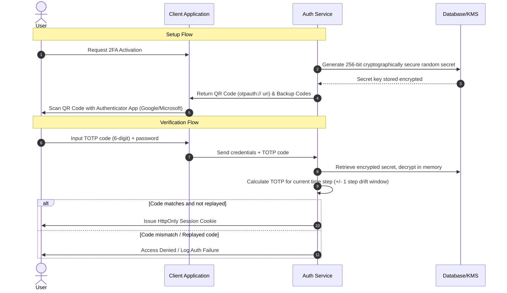

# Security Audit: Authentication & Authorization Architecture

This document provides a critical, data-driven security assessment and architectural guidelines for the authentication, authorization, and infrastructure design of the Flux Tickets platform.

---

## 1. Authentication & Session Management

### Session Token Storage: localStorage vs. Cookies
Storing session tokens (such as JWTs) in `localStorage` is **not recommended** for applications handling sensitive user data, financial transactions, or administrative capabilities.

#### Vulnerability Analysis (XSS & Token Theft)
*   **The Threat**: `localStorage` has no protection against Cross-Site Scripting (XSS). Any JavaScript code running on the origin (including third-party scripts, compromised npm packages, or CDN-injected scripts) can access `localStorage` via the synchronous `window.localStorage` API.
*   **Implication**: If an XSS vulnerability is exploited, an attacker can silently read the token and exfiltrate it.

#### Industry Standard: HttpOnly & Secure Cookies
The industry-standard mitigation is to store session and refresh tokens in cookies configured with the following flags:
*   **`HttpOnly`**: Instructs the browser that the cookie is inaccessible via client-side scripts (`document.cookie` returns empty). This eliminates token exfiltration via basic XSS.
*   **`Secure`**: Ensures that the cookie is transmitted only over encrypted (HTTPS) connections, preventing interception via man-in-the-middle (MITM) attacks.
*   **`SameSite=Strict` or `SameSite=Lax`**: Limits cross-site request forgery (CSRF) risks by controlling whether cookies are sent with cross-site requests.
*   **`Path` and `Domain`**: Scopes the cookie strictly to the API endpoint (e.g., `/api/auth`) to limit the attack surface.

```
┌────────────────────────────────────────────────────────────────────────┐
│                        XSS Mitigation Layer                            │
├──────────────────────────────┬─────────────────────────────────────────┤
│ Storage Type                 │ Client-side Access (XSS Exposure)       │
├──────────────────────────────┼─────────────────────────────────────────┤
│ localStorage                 │ Vulnerable (Read/Write via JS)          │
│ Standard Cookie              │ Vulnerable (Read/Write via document.cookie)│
│ HttpOnly & Secure Cookie     │ Safe (Blocked from JS Runtime)          │
└──────────────────────────────┴─────────────────────────────────────────┘
```

---

### One-Time Password (OTP) & Two-Factor Authentication (2FA)

A secure 2FA architecture should support cryptographically bound mechanisms like Time-Based One-Time Passwords (TOTP - RFC 6238) as the primary option, with SMS/Email as fallbacks.

#### Technical Architecture



#### Key Implementation Details
1.  **Secret Key Storage**:
    *   Secrets must never be stored in plaintext. They should be encrypted at rest using an authenticated encryption algorithm (such as AES-256-GCM) with keys managed by a Key Management Service (KMS) or hardware security module (HSM).
2.  **TOTP vs. SMS/Email**:
    *   **TOTP (RFC 6238)**: Uses a shared secret and Unix time steps. Safe from intercept, operates offline, and is highly resistant to phishing when combined with modern passkey frameworks.
    *   **SMS/Email**: Highly vulnerable to **SIM swapping**, signaling system exploits (SS7 interception), and account takeovers of the underlying email provider. They should be phased out or relegated to lowest-tier confirmation mechanisms.
3.  **Replay Attack Prevention**:
    *   Maintain a cache (e.g., Redis) of validated OTP tokens for the duration of the validity window (typically 30–90 seconds) to prevent token reuse.

---

### Password Security & Credential Validation

Weak passwords are the leading cause of credential stuffing and brute-force attacks. Implement robust validation beyond arbitrary character checks.

*   **Entropy-Based Checks**: Use zxcvbn or similar entropy calculators instead of naive regex checks. Reject passwords with low entropy (under 3 or 4 stars), even if they meet length/character class criteria.
*   **Dictionary and Pattern Blocking**: Maintain a blacklist of common passwords, sequential characters (`12345`), keyboard paths (`qwerty`), and user-specific details (username, email, birthdate).
*   **Breached Password Checks**: Integrate real-time checks using API queries (e.g., HaveIBeenPwned) via the **k-Anonymity model** (where only the first 5 characters of the SHA-1 hash of the password are sent to the external API, ensuring the password is never leaked).

---

## 2. Authorization & Data Integrity

### Client-Side vs. Server-Side Authorization

Client-side "admin check" logic is solely a user experience enhancement (hiding/showing buttons and navigation links). It provides **zero security guarantee**.

```
┌────────────────────────────────────────────────────────┐
│                  CLIENT-SIDE BROWSER                   │
│  [ Admin Dashboard UI ] -> (Can be bypassed via DevTools) │
└───────────────────────────┬────────────────────────────┘
                            │ (Bypassed Request)
                            ▼
┌────────────────────────────────────────────────────────┐
│                   SERVER-SIDE API                      │
│  [ Middleware: verifyRole('ADMIN') ] ── Authenticates   │
│             │                                          │
│      Valid  ▼                                          │
│  [ Execute Action ]                                    │
└────────────────────────────────────────────────────────┘
```

#### The Rule of Server-Side Enforcement
All operations must undergo verification in the server-side controller/middleware layer.
*   **Token Verification**: Extract role claims (e.g., `role: 'ORGANIZER'`) from the cryptographically verified JWT payload.
*   **Database Lookup**: For high-privilege actions, query the user status directly from the data source to confirm their permissions have not been revoked.

---

### Insecure Direct Object Reference (IDOR) Prevention

IDOR occurs when access controls are not verified when retrieving objects by identifier.

#### Mitigation Framework
1.  **Implicit Context Checking**: Never trust a user-provided owner ID. Retrieve the current authenticated user identity (`req.user.id`) from the request context and scope database queries to that ID:
    ```typescript
    // Vulnerable
    const tickets = await prisma.ticket.findMany({ where: { userId: req.body.userId } });

    // Secure
    const tickets = await prisma.ticket.findMany({ where: { userId: req.user.id } });
    ```
2.  **Resource Ownership Middleware**: Implement reusable middleware for updates or deletes to verify permissions:
    ```typescript
    async function checkTicketOwnership(req, res, next) {
      const ticket = await prisma.ticket.findUnique({ where: { id: req.params.id } });
      if (!ticket || ticket.userId !== req.user.id) {
        return res.status(403).json({ error: "Access Denied" });
      }
      next();
    }
    ```
3.  **Non-Enumerable Identifiers**: Use cryptographically secure, random identifiers (like UUIDv4 or NanoID) instead of auto-incrementing integer keys. This stops attackers from scanning resources sequentially.

---

## 3. Infrastructure & Defense in Depth

### Rate Limiting Strategy
Rate limits must protect critical vectors to prevent brute-force attacks, resource exhaustion, and economic attacks (e.g., ticket scalping bots).

#### Overlooked and Critical Endpoints
*   **Authentication & MFA (`/api/auth/login`, `/api/auth/mfa`)**: Strictly limit attempts per IP address and per user account to prevent distributed credential stuffing.
*   **Password Reset Requests (`/api/auth/forgot-password`)**: Prevent mailer resource exhaustion and user enumeration.
*   **Sign-up/Registration (`/api/auth/register`)**: Limit to block automated bot accounts.
*   **Payment Checkout (`/api/tickets/checkout`)**: Protect against inventory locking (scalping bots holding tickets) and card-testing frauds.
*   **Heavy Compute/Reporting (`/api/analytics/export`)**: Limit frequency to prevent denial of service (DoS) on database CPU cycles.

---

### Secure Error Handling & Information Disclosure

Detailed errors provide attackers with database structures, library names, and internal paths.

#### Best Practices
1.  **Generic External Messages**: Return clean, generic messages to the end user:
    ```json
    {
      "status": 500,
      "message": "An unexpected error occurred. Please contact support.",
      "correlationId": "err_9f1a23b4"
    }
    ```
2.  **Verbose Internal Logs**: Log full stack traces, database queries, and context variables internally in a secure, central logging infrastructure.
3.  **Sanitization Middleware**: Implement global catch-all handlers to format errors before they leave the application boundary.

---

### Audit Logging & Security Monitoring

When a breach occurs, log records are crucial for forensic analysis.

#### Minimum Required Events
*   Successful/Failed login attempts (including IP, user-agent, username).
*   Password changes, MFA reset triggers, and token revocation.
*   Administrative actions (role changes, configuration modifications).
*   High-risk resource changes (ticket pricing updates, event cancellations, deletion of orders).

#### Structure & Format
Log entries must be structured (e.g., JSON format) to allow ingestion into SIEMs (Splunk, ELK stack).
```json
{
  "timestamp": "2026-06-18T14:45:15Z",
  "level": "WARN",
  "eventId": "auth.failed",
  "actor": {
    "userId": null,
    "ip": "203.0.113.195",
    "userAgent": "Mozilla/5.0..."
  },
  "context": {
    "username": "admin@flux.ticket",
    "reason": "invalid_totp_token"
  },
  "correlationId": "req-9b8c7d6e"
}
```

---

### Dependency Management & CI/CD Auditing

Vulnerable open-source packages are an entry point for supply-chain attacks.

#### Auditing Pipeline Integration
*   **Static Scanning**: Run `npm audit` or `yarn audit` as part of the linting/testing phase in the CI/CD pipeline.
*   **Automation**: Use software composition analysis (SCA) tools like Dependabot, Snyk, or OWASP Dependency-Check.
*   **CI Policy Enforcement**: Configure build runners to fail if vulnerabilities exceeding a specific threshold (e.g., High or Critical severity) are identified.
    ```bash
    npm audit --audit-level=high
    ```
