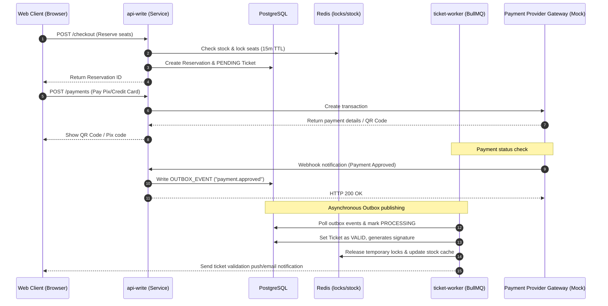
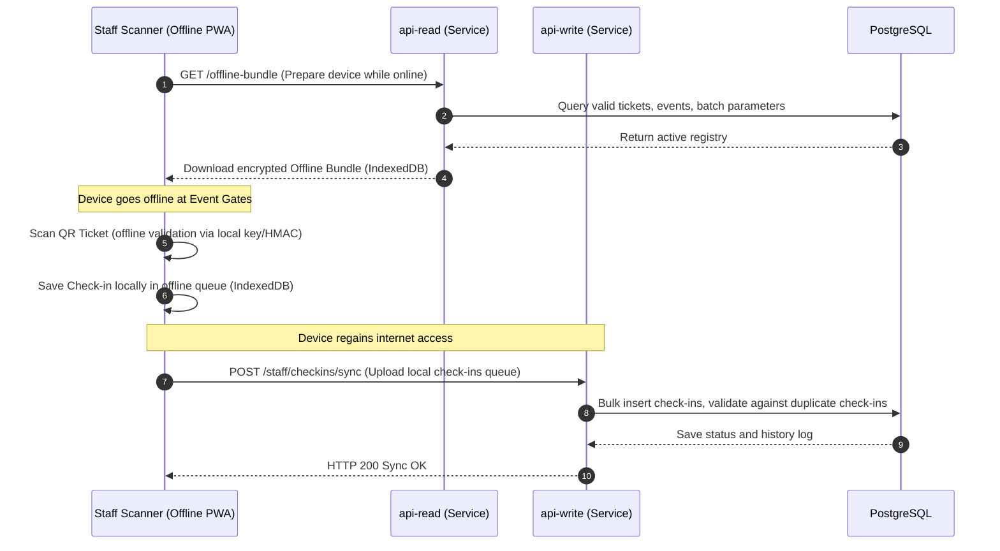

# Architecture

> Version: 2.0
> Last Updated: June 2026

---

# Overview

The Flux Tickets architecture is built around domain separation, service isolation, and event-driven communication.

Instead of a single monolithic application, the platform is composed of specialized services that each own a specific responsibility.

This architecture allows the platform to scale individual components independently while maintaining a single source of truth for business operations.

---

# Architecture Goals

The architecture is designed to provide:

- High availability
- Horizontal scalability
- Service isolation
- Clear business boundaries
- Reliable asynchronous processing
- Complete observability
- Deterministic business behavior

---

# High-Level Architecture

```text
                 Consumer Portal
                 Organizer Dashboard
                 Staff PWA
                         │
                         ▼
                  API Gateway (Future)
                         │
        ┌────────────────┴────────────────┐
        ▼                                 ▼
    api-read                        api-write
        │                                 │
        │                                 │
        └──────────────┬──────────────────┘
                       ▼
                  PostgreSQL
                       │
             ┌─────────┴─────────┐
             ▼                   ▼
          Redis            Outbox Events
                                   │
                                   ▼
                            Ticket Worker
                                   │
                                   ▼
                              BullMQ Queues
```

## System Interaction Diagrams

### 1. Asynchronous Checkout & Ticket Issuance Flow


### 2. Offline Staff PWA Bundle Synchronization Flow


---

# Applications

Current applications:

```text
apps/client

apps/dashboard

apps/staff-pwa
```

Each application has a single responsibility.

---

# Consumer Portal

Responsible for:

- Event catalog
- Checkout
- Orders
- Payments
- Customer tickets

Consumes:

```text
api-read

api-write
```

The Consumer Portal never communicates directly with the database.

---

# Organizer Dashboard

Responsible for:

- Event management
- Analytics
- Dashboard
- Reports
- Operational alerts

Consumes:

```text
api-read
```

Dashboard calculations are performed exclusively by the backend.

---

# Staff PWA

Responsible for:

- QR scanning
- Offline validation
- Offline synchronization
- Check-ins

Consumes:

```text
api-read

api-write
```

Offline validation is supported through IndexedDB.

---

# Services

Current backend services:

```text
api-read

api-write

ticket-worker
```

Each service owns a different business responsibility.

---

# api-read

Purpose:

Serve read-only data.

Responsibilities:

- Public catalog
- Dashboard
- Staff bundles
- Event listings
- Analytics endpoints

Characteristics:

- Stateless
- Read-only
- Cache friendly

---

# api-write

Purpose:

Execute business transactions.

Responsibilities:

- Reservations
- Checkout
- Payments
- Ticket issuance requests
- Check-ins
- Waitlists

Every business mutation originates here.

---

# ticket-worker

Purpose:

Execute asynchronous work.

Responsibilities:

- Queue processing
- Payment recovery
- Ticket issuing
- Notifications
- Waitlist invitations
- Background jobs

Workers never expose HTTP endpoints.

---

# Database

Current database:

```text
PostgreSQL
```

Responsibilities:

- Source of truth
- Transactions
- Business entities
- Audit
- Ticket lifecycle

Every service communicates through Prisma.

---

# Redis

Redis stores temporary operational data.

Responsibilities:

- Reservation locks
- BullMQ backend
- Distributed locks
- Temporary cache

Redis is never considered the source of truth.

---

# BullMQ

BullMQ executes asynchronous business operations.

Current queues include:

```text
payments.webhook

payments.recoverPending

tickets.issue

checkins.sync

analytics.aggregate

waitlist.invite

carts.expireAbandoned

notifications.placeholder
```

Every queue has a matching dead-letter queue.

---

# Outbox Pattern

Business events never call workers directly.

Flow:

```text
Business Transaction

↓

OutboxEvent

↓

Worker

↓

Queue

↓

Execution
```

This guarantees reliable asynchronous processing.

---

# Business Domains

Current domains:

```text
Identity

Catalog

Checkout

Payments

Ticket Engine

Staff

Dashboard

Infrastructure
```

Each domain owns its own business rules.

---

# Communication Model

The platform follows synchronous reads and asynchronous side effects.

Example:

```text
Checkout

↓

Payment Approved

↓

HTTP Response
```

Side effects:

```text
Payment Approved

↓

Outbox

↓

Worker

↓

Ticket Issue

↓

Notification
```

The customer does not wait for downstream operations.

---

# Request Flow

Example:

```text
Browser

↓

api-write

↓

Database Transaction

↓

Outbox

↓

Response

↓

Worker

↓

Notification
```

The response is returned immediately after the transaction commits.

---

# Read Flow

Example:

```text
Browser

↓

api-read

↓

Database

↓

Response
```

No business mutation occurs.

---

# Shared Packages

Current shared packages include:

```text
packages/database

packages/types

packages/shared

packages/ui
```

Shared packages prevent code duplication between services. 
See `docs/02-architecture/form-system.md` for details on the shared Form Architecture (`@flux/ui`).

---

# Dependency Rules

Allowed:

```text
Apps

↓

APIs

↓

Database
```

Forbidden:

```text
Dashboard

↓

Database
```

Likewise:

```text
Staff PWA

↓

Database
```

Applications always consume APIs.

---

# Configuration

Services use environment variables.

Examples:

```text
DATABASE_URL

REDIS_URL

JWT_SECRET

HMAC_SECRET

SENTRY_DSN
```

Secrets are never committed to the repository.

---

# Observability

Every service exposes:

```text
/health/live

/health/ready

/version

/metrics
```

Structured logging is implemented with Pino.

Optional Sentry integration provides exception tracking.

---

# Scalability

Each service scales independently.

Possible future deployment:

```text
3x api-read

2x api-write

5x ticket-worker
```

Redis and PostgreSQL remain shared infrastructure.

---

# Security

Security is enforced at multiple layers:

- JWT authentication
- RBAC authorization
- HMAC signatures
- Audit logging
- Request IDs
- Idempotency
- Structured logging

Additional protections are documented in `SECURITY.md`.

---

# Future Services

Potential future services include:

```text
notification-service

analytics-service

financial-service

admin-service

public-api
```

The current architecture already supports service extraction.

---

# Design Principles

The Flux Tickets architecture is built around:

- Domain separation
- Stateless services
- Event-driven processing
- Backend-owned business logic
- Provider independence
- High concurrency
- Complete observability
- Horizontal scalability

These principles allow the platform to evolve without introducing tight coupling between applications or business domains.

---

# Next Section

Part 2 documents:

- Internal package organization
- Repository structure
- Workspace architecture
- Service lifecycle
- Deployment topology
- Failure recovery
- Scaling strategy
- Future microservice evolution

---

# Quality Assurance & Verification

The platform enforces a strict testing pyramid to ensure business continuity:

- **Unit & Integration**: Validates business schemas, API contracts, and component composition.
- **End-to-End & Regression**: Protects critical revenue paths (Checkout, Ticket Issuance, Check-in).
- **Performance**: Validates massive concurrent reservation loads via Redis.

Detailed strategies are documented in the `docs/03-quality/` directory.

---
---

# Repository Structure

Flux Tickets is organized as a monorepo.

Every application and service lives in a dedicated workspace while sharing common packages.

Current high-level structure:

```text
apps/

packages/

services/

scripts/
```

This organization minimizes code duplication while keeping business responsibilities isolated.

---

# Applications

```text
apps/

├── client
├── dashboard
└── staff-pwa
```

Each application owns its UI.

Business logic remains in backend services.

---

## apps/client

Responsibilities:

- Event catalog
- Checkout
- Consumer tickets
- Order history
- Payment experience

Consumes:

```text
api-read

api-write
```

---

## apps/dashboard

Responsibilities:

- Organizer management
- Analytics
- Operational monitoring
- Event administration

Consumes:

```text
api-read
```

Business calculations are never performed inside React components.

---

## apps/staff-pwa

Responsibilities:

- Offline validation
- QR scanning
- Local synchronization
- Operational check-ins

Uses:

- IndexedDB
- Service Worker
- Offline Bundle

---

# Services

```text
services/

├── api-read
├── api-write
└── ticket-worker
```

Each service has independent responsibilities.

---

## api-read

Characteristics:

- Stateless
- Read-only
- No business mutations
- Cache-friendly

Typical endpoints:

```text
/events

/dashboard

/staff/events/:id/offline-bundle
```

---

## api-write

Characteristics:

- Transactional
- Business rules
- Payment orchestration
- Ticket lifecycle

Typical endpoints:

```text
/reservations

/payments

/staff/checkins/sync
```

---

## ticket-worker

Characteristics:

- No HTTP interface
- Queue consumer
- Background processing
- Retry-safe

Consumes:

```text
BullMQ

OutboxEvent
```

---

# Shared Packages

Current shared packages:

```text
packages/database

packages/types

packages/shared
```

Future packages may include:

```text
packages/ui

packages/config

packages/testing
```

---

## packages/database

Contains:

- Prisma schema
- Migrations
- Prisma client
- Database utilities

Every service imports the same database package.

---

## packages/types

Contains shared TypeScript types.

Examples:

- DTOs
- Enums
- API Contracts
- Shared interfaces

Frontend and backend always consume identical types.

---

## packages/shared

Reserved for reusable business utilities.

Examples:

- helpers
- validators
- formatting
- crypto helpers

No service-specific code belongs here.

---

# Scripts

```text
scripts/
```

Contains:

- smoke tests
- validation scripts
- migration helpers
- maintenance scripts

Scripts are disposable and never contain business logic.

---

# Dependency Direction

The dependency graph should always flow downward.

```text
Apps

↓

Services

↓

Packages

↓

Database
```

Never:

```text
Database

↓

Services

↓

Apps
```

---

# Service Lifecycle

Every request follows the same lifecycle.

```text
HTTP Request

↓

Middleware

↓

Authentication

↓

Controller

↓

Service

↓

Database

↓

Response
```

Asynchronous work is delegated after commit.

---

# Worker Lifecycle

Worker execution follows:

```text
Queue

↓

Worker

↓

Business Service

↓

Database

↓

Outbox

↓

Completion
```

Workers should never communicate directly with frontend applications.

---

# Deployment Topology

Current logical deployment:

```text
Internet

↓

Reverse Proxy

↓

api-read

api-write

↓

PostgreSQL

Redis

↓

ticket-worker
```

Applications are deployed independently.

---

# Horizontal Scaling

Services scale independently.

Examples:

Heavy traffic:

```text
api-read ×5
```

Large events:

```text
ticket-worker ×10
```

Checkout load:

```text
api-write ×3
```

Scaling one service should not require scaling the others.

---

# Failure Isolation

Each service should fail independently.

Example:

```text
ticket-worker offline
```

Effects:

- Checkout still works
- Dashboard still loads
- Staff validation still functions
- Background jobs pause

The platform degrades gracefully.

---

# Recovery Strategy

Recovery follows:

```text
Failure

↓

Retry

↓

Dead Letter

↓

Manual Investigation

↓

Replay
```

Every asynchronous operation should be recoverable.

---

# Configuration Management

Configuration is externalized through environment variables.

Examples:

```text
DATABASE_URL

REDIS_URL

JWT_SECRET

HMAC_SECRET

SENTRY_DSN

PROMETHEUS_ENABLED
```

No runtime configuration should be hardcoded.

---

# Build Strategy

Each workspace builds independently.

Examples:

```bash
npm run build --workspace @flux/api-read

npm run build --workspace @flux/api-write

npm run build --workspace @flux/ticket-worker

npm run build --workspace @flux/dashboard

npm run build --workspace @flux/client
```

Independent builds simplify CI/CD pipelines.

---

# Testing Strategy

Testing occurs at multiple levels.

```text
Unit Tests

↓

Integration Tests

↓

Smoke Tests

↓

Concurrency Tests

↓

Queue Validation

↓

Production Validation
```

Each layer validates a different concern.

---

# Future Evolution

The current architecture allows extracting dedicated services without changing application behavior.

Possible future services:

```text
analytics-service

notification-service

financial-service

admin-service

marketing-service

public-api
```

Because communication already occurs through explicit APIs and asynchronous events, service extraction becomes an infrastructure decision rather than an architectural rewrite.

---

# Architecture Principles

The Flux Tickets architecture is designed to remain:

- modular
- maintainable
- observable
- horizontally scalable
- provider independent
- event driven
- domain oriented

As the platform grows, new applications and services should integrate by consuming existing contracts instead of bypassing established boundaries.

---

# Architecture Complete

Together, Parts 1 and 2 describe the complete system architecture, repository organization, service boundaries, deployment model, and scalability strategy that guide every component of the Flux Tickets platform.

---
